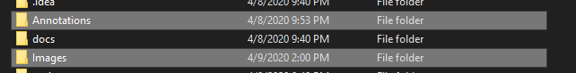
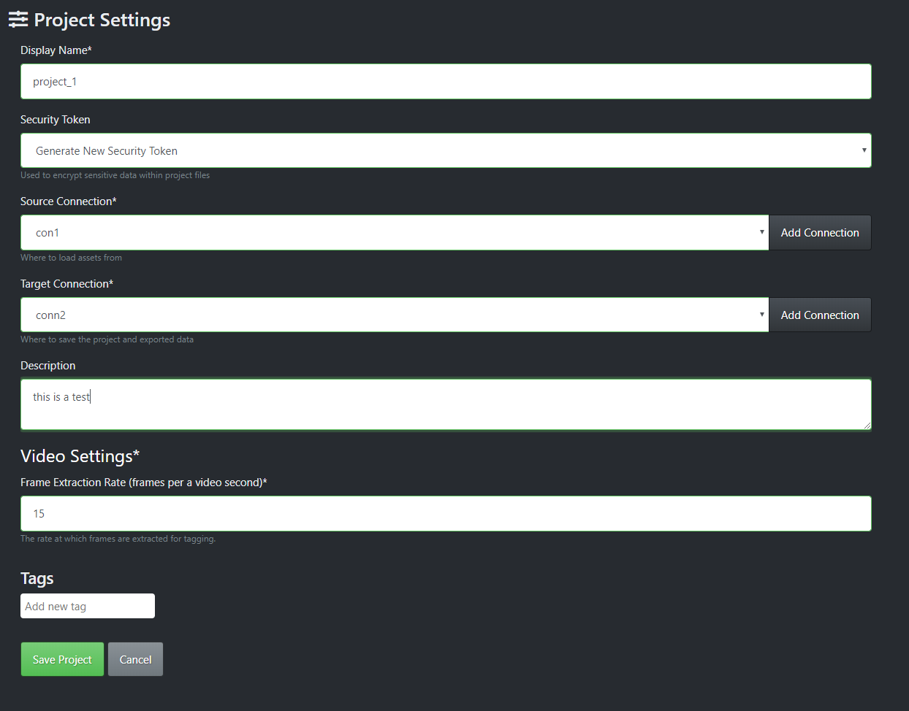
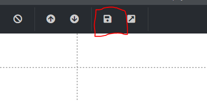
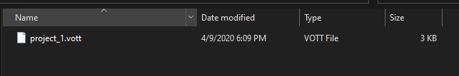
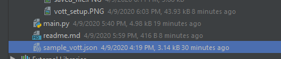
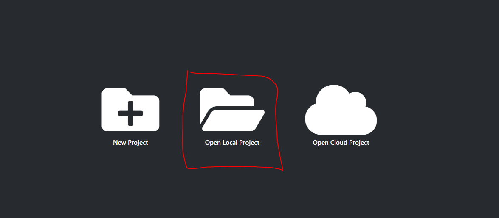
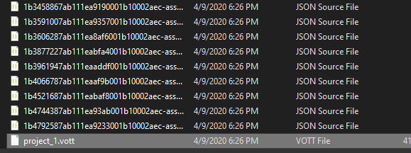

**How To Run**

<h5>Make sure your pascal voc data is separated into two folders, annotations [.xml] and images [.jpg, .png]</h3>

<h5>Set up a project in VOTT, connecting it to your dataset's images folder create a folder in which your output will be stored use that as target connection</h5>

<h5>When the project opens, immediately save it without making any changes</h5>

<h5>This will project a file `[project_name].vott` in the directory you specified as the target.</h5>

<h5>Copy this file into this repo's root directory and rename it to `sample_vott.json` </h5>

<h5>Now execute</h5>
<h5>`python3 main.py --out_dir [path to directory you want to store the results]  --anno_path [path to directory containing all .xml files]`</h5>

<h5>Please note that `out_dir` should be the absolute to the same directory as `[project_name].vott` mentioned earlier</h5>
<h5>Please note that `anno_path` should be the absolute to the same directory as where your dataset's images are stored.</h5>

<h5>This should produce all the necessary files that VOTT uses along with a file called `output.vott`. Rename this file to the name of `[project_name].vott` as mentioned earlier</h5>

<h5>And that's it. Close and reopen VOTT and open a local project</h5>

<h5>Search for the .vott file and open it</h5>

<h5>You should now be able to see all your labelled images</h5>
<h5>This worked for me, please feel free to edit it as you see fit to make it work for you if it doesn't out of the box. Happy Coding</h5>
